# ArcNerf

ArcNerf is a framework consist of many state-of-the-art NeRF-based methods with useful functionality on novel view rendering
and object extraction.

The framework is highly modular, which allows you to modify any component in the pipeline and develop your own algorithm easily.

It is developed by [TencentARC Lab](https://arc.tencent.com/).


------------------------------------------------------------------------
# What is special in this project?

In the recent few months, many frameworks working on common NeRF-based pipeline have been proposed:

- [NeRFStudio](https://github.com/nerfstudio-project/nerfstudio)
- [NeRF-Factory](https://github.com/kakaobrain/NeRF-Factory)
- [Wisp](https://github.com/NVIDIAGameWorks/kaolin-wisp)
- [JNeRF](https://github.com/Jittor/JNeRF)
- [XRNeRF](https://github.com/openxrlab/xrnerf)

(And a very nice start-up company [Luma.ai](https://captures.lumalabs.ai/) is working on NeRF based real-time rendering on 3d scene.)

All those amazing works are trying to bring those state-of-the-art NeRF-based methods together into
a complete, modular framework that is easy to change any of the components and conduct experiment quickly.

Toward the same goal, we are working on those fields could make this project helpful to the community:

* Here is the framework overview. Notice that not all the designed feature have been implemented in this framework(eg. Traditional MVS Branch).
We are working on extending it in the coming future.

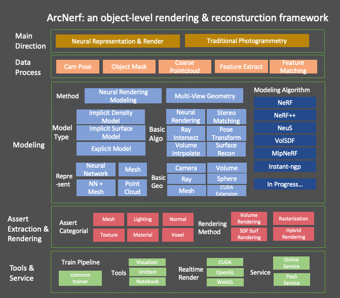


- Highly modular design of pipeline:
  - Every field is seperated, and you can plug in any new developed module under the framework. Those fields
  can be easily controlled by the config files and modified without harming others.
  - We provide both sdf model, background model for modeling object and background as well, which are not commonly provided
  in other repo.

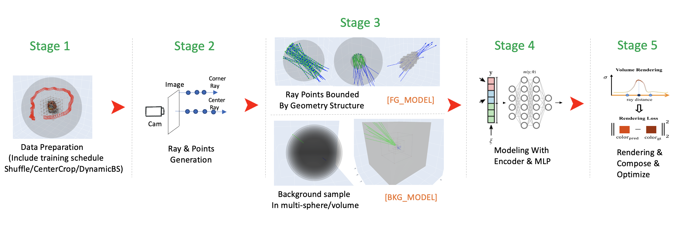

  - Based on this pipeline, we can easily extend original nerf/neus model for:
    - NeRF with pruning volume, with freq embed
    - NeRF with hashGrid embed
    - NeRF with hashGrid embed + volume pruning -> NGP model
    - NeuS with pruning volume, with freq embed
    - NeuS with hashGrid embed
    - NeuS with hashGrid embed + volume pruning -> NeuS-NGP model
  - Plug-in the modules like volume pruning makes the speed faster and generate better result. See [expr](docs/expr.md) for more detail.
  - foreground_model and background_model are separate well. They each bound the modeling in in-out area by sphere, volume and other geometry structure. It is suitable for common daily captured video.
    which provide high quality object mesh and background rendering at the same time


  - Unified dataset and benchmark:
    - We split the dataset following on official repo, and all methods are running under the same settings for fair comparison.
    - We also make unittests for the datasets and you are easy to check whether the configs on the data is correct.

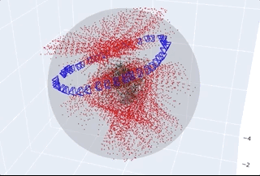

- Many useful functionality are provided:
  - Mesh extraction on Density Model or SDF Model. (We are still working on incorporating better extraction functions to collect Assets for Modern Graphic Engine)
  - Colmap preparation on your own capture data.
  - surface rendering on the sdf model
  - plentiful geometry functions implemented in torch backend.
  - For other functions on the trainer and logging, please ref [doc](docs/common_trainer.md).

- Render


- Extraction
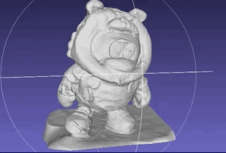
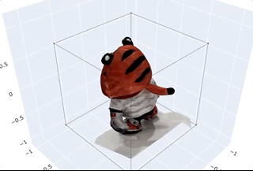


- Docs and Code:
  - All the functions are with detailed docs on its usage, and the operation are commented with its tensor size,
  which makes you easy to understand the change of components.
  - We have implemented helpful geometry function on mesh/rays/sphere/volume/cam_pose in torch(some in CUDA extension).
  It could be useful for you in other 3D-related projects as well.
  - We also provide our experiments [note](docs/expr.md) on our trails.


- Tests and Visual helpers:
  - We have developed an interactive visualizer to easily tests the correctness of our geometry function. It is compatible with torch/np arrays.
  - We have written a lots of unittest on the geometry and modelling functions. Take a look, and you will be easy to understand how
  to use the visualizer for checking your own implementation.

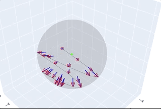
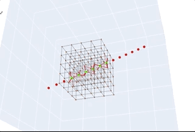
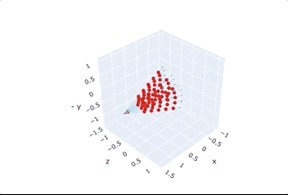


We are still working on many other helpful functions for better rendering and extraction, please ref [todo](docs/todolist.md) for more details.

Bring issues to us if you have any suggestion!

------------------------------------------------------------------------
# Installation
Get the repo by `git clone https://github.com/TencentARC/ArcNerf --recursive`

- Install libs by `pip install -r requirements.txt`.
- Install the customized ops by `sh scripts/install_ops.sh`. (Only for `volume sampling/pruning`, etc)
- Install tiny-cuda-nn modules by `sh scripts/install_tinycudann.sh`. (Only for `fusemlp`/`hashgrid encode`, etc)

We test on env with:
- GPU: NVIDIA-A100 with CUDA 11.1 (Lower version may harm the `tinycudann` module).
- cmake: 3.21.3  (>=3.21)
- gcc: 8.3.1   (>=5.4)
- python: 3.8.5  (>=3.7)
- torch: 1.9.1

## Colmap
Colmap is used to estimate camera locations and sparse point cloud. It will let you run the algorithm on your own data.

Install under their [instruction](https://github.com/colmap/colmap).

------------------------------------------------------------------------
# Usage

## Data Preparation
- Download and prepare public datasets ref to [instruction](docs/datasets.md).
- If you use you own captured data, `scripts/data_process.sh` will help you extract the frames
and estimate the camera.

## Train
Train by `python train.py --configs configs/default.yaml --gpu_ids 0`.

- `--gpu_ids -1` will use `cpu`, which is good for you to debug the code in local IDE like pycharm line by line without a GPU device.
- for more details on the `config`, go to [default.yaml](configs/default.yaml) for more details.
- add `--resume path/to/model` can resume training from checkpoints. Model will be saved periodically to forbid unpredictable error.
- For more detail of the training pipeline, visit [common_trainer](docs/common_trainer.md) and [trainer](docs/trainer.md).

## Evaluate
Eval by `python evaluate.py --configs configs/eval.yaml --gpu_ids 0`. You can set your target model by `--model_pt path/to/model`.

## Inference
Inference makes customized rendering video and extract mesh output.
Run by `python inference.py --configs configs/eval.yaml --gpu_ids 0`. You can set your target model by `--model_pt path/to/model`.

## Notebook
Some notebooks are provided for you to understand what is happening for inference and how to use our visualizer.
Go to [notebook](notebooks) for more details.

------------------------------------------------------------------------
## Datasets and Benchmarks
All the datasets inherit the same data class for ray generation, img/mask preparation. What you need to do in a new class
is to read image/camera poses under different mode split. The details are [here](docs/datasets.md).

### Self-Capture data and Colmap
We support customized data by `Capture` dataset. You can record a clip of video around the object and run the pre-process
script under `scripts/data_process.sh`. Notice that colmap results is highly correlated to your filming status. A clear, stable
video with full angle towards the object could bring more accurate result.

### Visual helper
We put all the dataset configs under [conf](configs/datasets), and you can check the result by running the unittest
`tests/tests_arcnerf/tests_dataset/tests_any_dataset.py` and see the results.

For any dataset that we have provided, you should check the configs like this to ensure the setting are correct.

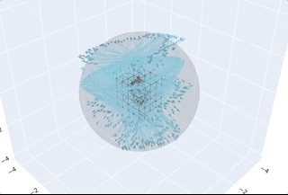
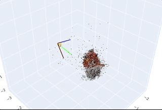


### Benchmark
See [benchmark](docs/benchmark.md) for details, and [expr](docs/expr.md) for some trails we have conducted and some problems we have meet.

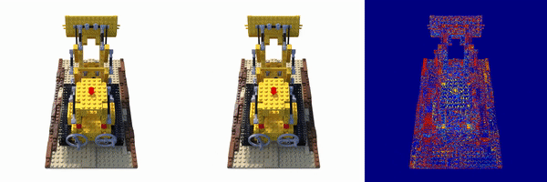
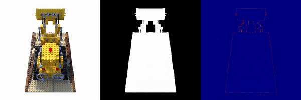


------------------------------------------------------------------------
## Models
The models are highly modular and are in level-structure. You are free to modify components at each level by configs,
or easily develop new algorithm and plug it in the desired place.

For more detail on the structure of model class, visit [model](docs/models.md) and understand each component of it.

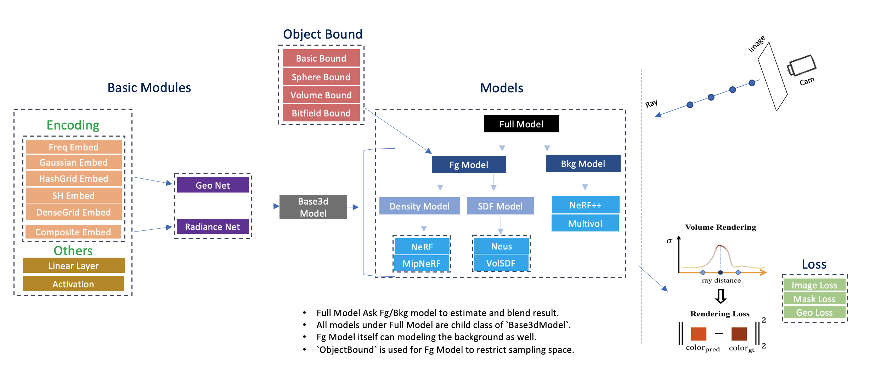

------------------------------------------------------------------------
## Geometry

We implement plentiful geometry functions in torch under [geometry](arcnerf/geometry). The operation are batch-based, and their
correctness are check under [unittests](tests/tests_arcnerf/tests_geometry).

You can see the [doc](docs/geometry.md) for more details and know what is support.

------------------------------------------------------------------------
## Visualization

We make a offline interactive 3d visualizer in `plotly` backend. All the geometry components
in `numpy` tensor could be easily plugin the visualizer. It is compatible to torch-template 3d
projects and helpful for you to debug your implementation of the geometric functions.

We provide a [notebook](notebooks/draw_3d_examples.ipynb) showing the example of usage.
You can ref the [doc](docs/visual.md) for more details.

There is also another repo contain this visualizer.
Please go to [ArcVis](https://github.com/TencentARC/ArcVis) if you find it is helpful.

------------------------------------------------------------------------
## Code and Tests

We have made many unittests for checking the geometry function and models. See [doc](docs/tests.md) to know
how to test and get visual results.

We suggest to you make your own unittests if you are developing new algorithms to ensure correctness.

Comments in code are also helpful for you to learn how to use the function and the change of tensor size.

------------------------------------------------------------------------
## Trainer

We use our own training pipeline, which provides many customized functionality.
It is modular and easy to add/modify and part of the training pipeline.

We have another repo [common_trainer](https://github.com/TencentARC/common_trainer).
Or you can ref the [doc](docs/common_trainer.md) for more information.

------------------------------------------------------------------------
# License

TODO

------------------------------------------------------------------------
# Acknowledgements
Please see [Citation](docs/citation.md). Thanks to those amazing projects.

If you find this project useful, please consider citing:
```
@misc{arcnerf,
  author={Yue Luo, Yan-Pei Cao},
  title={arcnerf: nerf-based object/scene rendering and extraction framework },
  url={https://github.com/TencentARC/arcnerf/},
  year={2022},
```

You can contact the author by `leoyluo@tencent.com` if you need any help.
