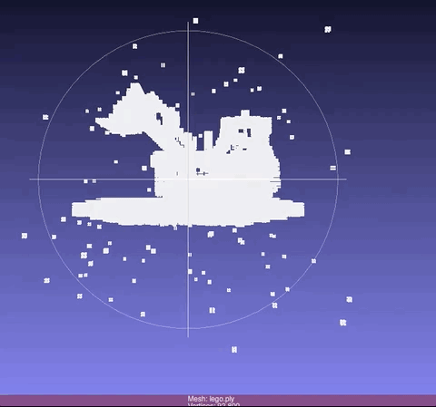

# simplengp

This branch is the simple ngp reimplementation of [instant-ngp](https://github.com/NVlabs/instant-ngp) by our common_trainer pipeline.

Function for NeRF/ngp provided and train/eval on lego. Complicated operation and pipeline not support.

Compared to other implementation(eg.[JNeRF](https://github.com/Jittor/JNeRF), [XRNeRF](https://github.com/openxrlab/xrnerf),
we try to bring main functions and param outside the cuda kernel so that you have more flexibility to easily modify it.


------------------------------------------------------------------------
# Installation
- Install libs by `pip install -r requirements.txt`.
- Install the customized ops by `sh scripts/install_ops.sh`.
- Install tiny-cuda-nn modules by `sh scripts/install_tinycudann.sh`.

We test on env with:
- GPU: NVIDIA-A100 with CUDA 11.1
- cmake: 3.21.3
- gcc: 8.3.1
- python: 3.8.5
- torch: 1.9.1

------------------------------------------------------------------------
# Usage
## Train
Train by `python train.py --configs configs/default.yaml --gpu_ids 0`. Do not support cpu(`-1`) due to the use of customized CUDA ops.

## Evaluate
Eval by `python evaluate.py --configs configs/eval.yaml --gpu_ids 0`. You can set your target model by `--model_pt path/to/model`.

------------------------------------------------------------------------
## Common_Trainer
The details of how to use the trainer please ref to [common_trainer](docs/common_trainer.md).

------------------------------------------------------------------------
# Results
By running `default.yaml`, you will get PSNR of `36.12` after 50K epoch on NeRF's lego dataset.(Paper reports `36.39`, but most replicate only reach `35+`).

One a A100 GPU, 800x800 images takes `~0.1s` to get the rgb result. (Chunk_rays: `32768=1024*32`/ Chunk_pts: `131072=4096*32`).

We also store the inner volume's occupied voxels for checking.



------------------------------------------------------------------------

# Benchmark on NeRF synthetic dataset
All run for 5w iter.

|          |   chair    |   drums    |   ficus    |   hotdog   |   lego     | materials  |    mic     |   ship     |   avg  |
|:--------:|:----------:|:----------:|:----------:|:----------:|:----------:|:----------:|:----------:|:----------:|:------:|
|paper     |   35.00    |   26.02    |   33.51    |   37.40    |   36.39    |   29.78    |   36.22    |   31.10    | 33.176 |
|simplengp |   34.28    |   25.70    |   33.13    |   36.99    |   36.12    |   29.35    |   35.67    |   30.61    | 32.731 |

Please see [expr](docs/expr.md) for more comparison on the settings.

------------------------------------------------------------------------
# Citation
Thanks the following authors for their projects:

- [tiny-cuda-nn](https://github.com/NVlabs/tiny-cuda-nn/)
```
@misc{tiny-cuda-nn,
    Author = {Thomas M\"uller},
    Year = {2021},
    Note = {https://github.com/nvlabs/tiny-cuda-nn},
    Title = {Tiny {CUDA} Neural Network Framework}
}
```

- [instant-ngp](https://github.com/NVlabs/instant-ngp)
```
@article{mueller2022instant,
    author = {Thomas M\"uller and Alex Evans and Christoph Schied and Alexander Keller},
    title = {Instant Neural Graphics Primitives with a Multiresolution Hash Encoding},
    journal = {ACM Trans. Graph.},
    issue_date = {July 2022},
    volume = {41},
    number = {4},
    month = jul,
    year = {2022},
    pages = {102:1--102:15},
    articleno = {102},
    numpages = {15},
    url = {https://doi.org/10.1145/3528223.3530127},
    doi = {10.1145/3528223.3530127},
    publisher = {ACM},
    address = {New York, NY, USA},
}
```

- [HashNeRF](https://github.com/yashbhalgat/HashNeRF-pytorch)
```
@misc{bhalgat2022hashnerfpytorch,
  title={HashNeRF-pytorch},
  author={Yash Bhalgat},
  publisher = {GitHub},
  journal = {GitHub repository},
  howpublished={\url{https://github.com/yashbhalgat/HashNeRF-pytorch/}},
  year={2022}
}
```

- [ngp_pl](https://github.com/kwea123/ngp_pl)
```
@misc{ngp_pl,
    Author = {Quei-An, Chen},
    Year = {2022},
    Note = {https://github.com/kwea123/ngp_pl},
    Title = {ngp_pl}
}
```

- [torch-ngp](https://github.com/ashawkey/torch-ngp)
```
@misc{torch-ngp,
    Author = {Jiaxiang Tang},
    Year = {2022},
    Note = {https://github.com/ashawkey/torch-ngp},
    Title = {Torch-ngp: a PyTorch implementation of instant-ngp}
}
```

- [JNeRF](https://github.com/Jittor/JNeRF)
```
@article{hu2020jittor,
  title={Jittor: a novel deep learning framework with meta-operators and unified graph execution},
  author={Hu, Shi-Min and Liang, Dun and Yang, Guo-Ye and Yang, Guo-Wei and Zhou, Wen-Yang},
  journal={Science China Information Sciences},
  volume={63},
  number={222103},
  pages={1--21},
  year={2020}
}
```

- [XRNeRF](https://github.com/openxrlab/xrnerf)
```
@misc{xrnerf,
    title={OpenXRLab Neural Radiance Field Toolbox and Benchmark},
    author={XRNeRF Contributors},
    howpublished = {\url{https://github.com/openxrlab/xrnerf}},
    year={2022}
}
```
