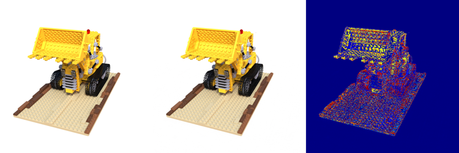
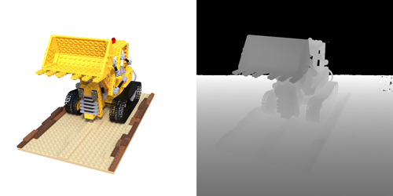
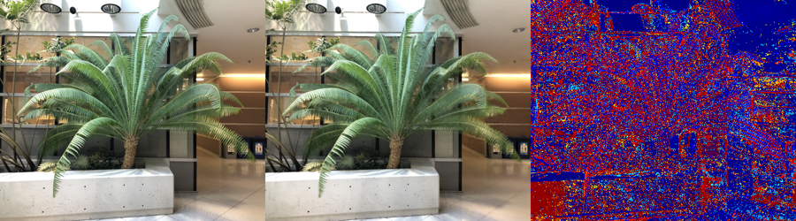
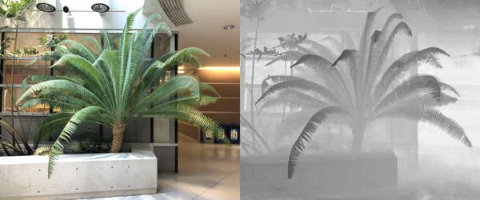

# simplenerf

This is the simple nerf reimplementation of [NeRF](https://www.matthewtancik.com/nerf) by our common_trainer pipeline.

Function for NeRF provided and train/eval on lego/fern. Complicated operation and pipeline not support. 

For more common nerf pipeline, please visit our repo [ArcNerf](https://github.com/TencentARC/ArcNerf). It is an easy-to-extent
framework that include many existing SOTA models.

 

 

------------------------------------------------------------------------
# Installation
Get the repo by `git clone https://github.com/TencentARC/simplenerf`

Install libs by `pip install -r requirements.txt`.

------------------------------------------------------------------------
# Usage
## Train
Train by `python train.py --configs configs/default.yaml --gpu_ids xx`. Support cpu by `--gpu_ids -1`.

## Evaluate
Eval by `python evaluate.py --configs configs/eval.yaml --gpu_ids xx`. You can set your target model by `--model_pt path/to/model`.

------------------------------------------------------------------------
## Common_Trainer
The details of how to use the trainer please ref to [common_trainer](docs/common_trainer.md).

------------------------------------------------------------------------
# Results
By running `default.yaml`, you will get PSNR of `32.85` after 300K epoch on NeRF's lego dataset.(Paper reports `32.54`).

One a V100 GPU, 800x800 images takes 27s to get the rgb result. (Chunk_rays: `32768=1024*32`/ Chunk_pts: `131072=4096*32`).


## Benchmark on NeRF synthetic dataset
All run for 30w iter.

|          |   chair    |   drums    |   ficus    |   hotdog   |   lego     | materials  |    mic     |   ship     |   avg  |
|:--------:|:----------:|:----------:|:----------:|:----------:|:----------:|:----------:|:----------:|:----------:|:------:|
|paper     |   33.00    |   25.01    |   30.13    |   36.18    |   32.54    |   29.62    |   32.91    |   28.65    | 31.043 | 
|simplenerf|   33.40    |   25.08    |   30.47    |   36.69    |   32.85    |   29.79    |   33.57    |   28.78    | 31.329 |


## Benchmark on LLFF Forward-face dataset
All run for 20w iter and in ndc-space.

|          |    fern    |   flower   |  fortress  |   horns    |   leaves   |  orchids   |    room    |   trex     |   avg  |
|:--------:|:----------:|:----------:|:----------:|:----------:|:----------:|:----------:|:----------:|:----------:|:------:|
|paper     |   25.17    |   27.40    |   31.16    |   27.45    |   20.92    |   20.36    |   32.70    |   26.80    | 26.495 | 
|simplenerf|   26.77    |   28.50    |   32.99    |   29.90    |   22.57    |   21.12    |   32.54    |   28.86    | 27.906 |


More expr log, please see [expr](docs/expr.md).

------------------------------------------------------------------------
# Citation
Thanks the following authors for their projects:
```
@misc{lin2020nerfpytorch,
  title={NeRF-pytorch},
  author={Yen-Chen, Lin},
  publisher = {GitHub},
  journal = {GitHub repository},
  howpublished={\url{https://github.com/yenchenlin/nerf-pytorch/}},
  year={2020}
}
```

```
@misc{mildenhall2020nerf,
    title={NeRF: Representing Scenes as Neural Radiance Fields for View Synthesis},
    author={Ben Mildenhall and Pratul P. Srinivasan and Matthew Tancik and Jonathan T. Barron and Ravi Ramamoorthi and Ren Ng},
    year={2020},
    eprint={2003.08934},
    archivePrefix={arXiv},
    primaryClass={cs.CV}
}
```

```
@misc{queianchen_nerf,
  author={Quei-An, Chen},
  title={Nerf_pl: a pytorch-lightning implementation of NeRF},
  url={https://github.com/kwea123/nerf_pl/},
  year={2020},
}
```