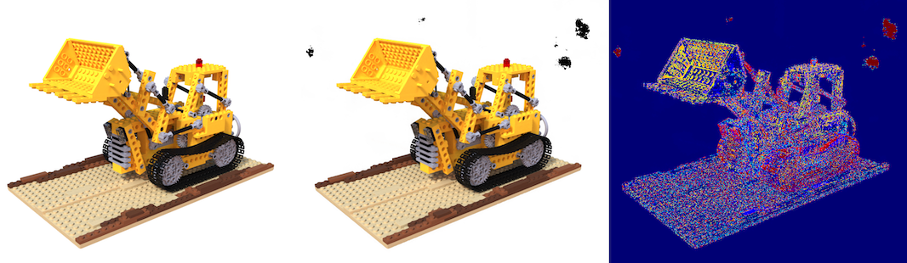
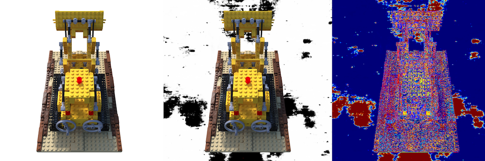

# Trails on Lego Scene
Here are the trails and experience on Lego scene.

# NeRF (density model)

For some basic setting like `lr`/`precrop`/`maskloss`, you can visit our project [simplenerf](http://github.com/TencentARC/simplenerf) for more experiment log.
But what worth notice is:
- precrop is important for such white_bkg case since nerf model is sensitive to initialization.

Thanks to our pipeline, we can easily change any part in the pipeline and see each what `pruning`/`embedding` contribute to the result:

Basic NeRF PSNR on Lego is `32.86`. [conf](../configs/expr/NeRF/lego/nerf_lego_nerf.yaml)

## In data preperation
- directly add `center_pixel` for ray generation improves NeRF(`freq embed`) performance(`~1`).  [conf](../configs/expr/NeRF/lego/trails/nerf_lego_nerf_centerpixel.yaml)

## embedding level
We can change `freqEncode` into `tcnn.HashGridEncoding/SHEncoding`.

- Using `ngp` like encodings, you must use `center_pixel`. Otherwise not converge. (This has also been proven in `ngp` model.)
Without using a shallow network, we can get PSNR `27.82`. [conf](../configs/expr/NeRF/lego/trails/nerf_lego_nerf_ngpembed_centerpixel_trunc.yaml).
It happens that geometry on object is good but noisy in empty space is heavy.

- Further, decrease the mlp size using a shallow MLP make the speed faster (`0.3 -> 0.05s/iter`). The object is converage well but empty space is even noisier.
[conf](../configs/expr/NeRF/lego/trails/nerf_lego_nerf_ngpembed_centerpixel_shallow_trunc.yaml).

## Volume Pruning
Based on original NeRF implementation, we can keep `freq embed`, can add volume structure with pruning to improve modelling and performance.
With such object structure, we can set the `n_sample` large(1024), and it will remain samples based on volume voxels.

- With directly sample 1024 pts and volume structure, speed and results both increase (`0.04s` + `PSNR 33.33`). [conf](../configs/expr/NeRF/lego/trails/nerf_lego_nerf_volumeprune_moresample_noimportance.yaml).

- If we use original 64 + 128 sampling method in NeRF, the result is lower to `27.57`, meaning that the coarse sampling is not accurate to produce `resample` points. [conf](../configs/expr/NeRF/lego/trails/nerf_lego_nerf_volumeprune.yaml).

## ngp
`instant-ngp` combines volume pruning with hash/sh encoding, for much faster converge.
You can visit our project [simplengp](http://github.com/TencentARC/simplengp) for more experiment log.

- We get `PSNR=34.31` for 5w iteration, base on volume-pruning and hashencoding. Many factors affects the result, you can see [simplengp](http://github.com/TencentARC/simplengp) for more detail.
The [conf](../configs/expr/NeRF/lego/nerf_lego_nerf_ngp.yaml).

- Using a smaller but closely bounding volume can slightly improve the result to `34.65`. Meaning that we can try to find more accurate bbox for better pruning and rendering result. [conf](../configs/expr/NeRF/lego/trails/nerf_lego_nerf_ngp_newvolume.yaml).

- Without the `fusemlp` but used original mlp with same size, the PSNR drop by `~0.4`. Not sure whether `bias` or other factors affect the result.

- resample more pts near surface can further improve the PSNR(`~0.3`), but time for each step will increase a lot.

------------------------------------------------------------------------------------------------------------

# MipNerf (for novel view rendering)
For mip-Nerf, it is hard to used for object extraction, but provide better rendering result.
Here are the trails and experience on Lego scene.

- `center_pixel` is necessary in `mipnerf` which is the same as official repo. Otherwise not converge well.
We get `PSNR=xx` by [conf](../configs/expr/NeRF/lego/nerf_lego_mipnerf.yaml).

- `blur_coarse_weight` before resample stage is importance. Without it, we get `xx`. [conf](../configs/expr/NeRF/lego/trails/nerf_lego_mipnerf_noblurweights.yaml).

- Remove `solfplus` on sigma make a loss around `xx`.  [conf](../configs/expr/NeRF/lego/trails/nerf_lego_mipnerf_nosoftplus.yaml).

------------------------------------------------------------------------------------------------------------

# NeuS (sdf model)

Basic NeuS PSNR on Lego is `30.71`. [conf](../configs/expr/NeRF/lego/nerf_lego_neus.yaml).

Except for volume rendering, we have surface rendering on sdf model, which takes the color from surface point seaching by sphere tracing. Its speed will be much faster.

## In data preperation
- directly add `center_pixel` for ray generation improves NeuS(`freq embed`) performance(`~2`).  [conf](../configs/expr/NeRF/lego/trails/nerf_lego_neus_centerpixel.yaml)

## embedding level
We can change `freqEncode` into `tcnn.HashGridEncoding/SHEncoding`.

- Using `ngp` like encodings, you must use `center_pixel`. Otherwise not converge. (This has also been proven in `ngp` model.)

- Unlike NeRF(density model), directly use hash encoding push up the result.

- Full mlp gets `34.16` [conf](../configs/expr/NeRF/lego/trails/nerf_lego_neus_ngpembed_centerpixel.yaml),
and a shallow network get `32.75` [conf](../configs/expr/NeRF/lego/trails/nerf_lego_neus_ngpembed_centerpixel_shallow.yaml).

## Volume Pruning
Based on original NeuS implementation, we can keep `freq embed`, can add volume structure with pruning to improve modelling and performance.
With such object structure, we can set the `n_sample` large(1024), and it will remain samples based on volume voxels.

- With directly sample 1024 pts and volume structure, speed increase. But PSNR gets down. (Only `28.92` now). [conf](../configs/expr/NeRF/lego/trails/nerf_lego_neus_volumeprune_moresample_noimportance.yaml).
Possibly because the sdf model is sensitive to the surface.

- With 1024 coarse sample and 64 surface samples, PSNR increases to `29.80`. But time also increase. [conf](../configs/expr/NeRF/lego/trails/nerf_lego_neus_volumeprune_moresample.yaml).

- If we use original 64 + 64 sampling method in NeuS, the result is lower to `22.96`, meaning that the coarse sampling is not accurate to produce `resample` points. [conf](../configs/expr/NeRF/lego/trails/nerf_lego_neus_volumeprune.yaml).

## ngp
`instant-ngp` combines volume pruning with hash/sh encoding, for much faster converge. It can also be applied to SDF model.

- We get `PSNR=30.26` for 5w iteration, base on volume-pruning and hashencoding. It is worse than original NeuS.

- Using a smaller but closely bounding volume can slightly improve the result to `30.95` (But actually worse than NeuS with center_pixel, maybe more iteration needed).
Meaning that we can try to find more accurate bbox for better pruning and rendering result. [conf](../configs/expr/NeRF/lego/trails/nerf_lego_neus_ngp_newvolume.yaml).

- resample more pts near surface can further improve the PSNR(`~0.25`), but time for each step will double.  [conf](../configs/expr/NeRF/lego/trails/nerf_lego_neus_ngp_resample.yaml).

------------------------------------------------------------------------------------------------------------

# volsdf (sdf model)

- Compared to NeuS model, it's performance do not get better(`~28`). We don't perform extra experiment on it.

------------------------------------------------------------------------------------------------------------
Summary:

|          model            | PSNR  |  iter/s | Num iter | eval s/img | conf file|
|:-------------------------:|:-----:|:-------:|:--------:|:----------:|:--------:|
| NeRF                      | 32.86 | 0.25s   |  30w     | 10s        | [conf](../configs/expr/NeRF/lego/nerf_lego_nerf.yaml) |
|+center_pixel              | 33.80 | 0.25s   |  30w     | 10s        | [conf](../configs/expr/NeRF/lego/trails/nerf_lego_nerf_centerpixel.yaml)
|  +hash/sh encoder           | 27.82 | 0.32s   |  30w     | 10s        | [conf](../configs/expr/NeRF/lego/trails/nerf_lego_nerf_ngpembed_centerpixel_trunc.yaml)
|  +hash/sh encoder + shallow | 9.27 | 0.05s   |  30w     | 1.3s       | [conf](../configs/expr/NeRF/lego/trails/nerf_lego_nerf_ngpembed_centerpixel_shallow_trunc.yaml)
|+volume pruning(1024 pts)  | 33.33 | 0.04s   |  30w     | 0.84s      | [conf](../configs/expr/NeRF/lego/trails/nerf_lego_nerf_volumeprune_moresample_noimportance.yaml)
|+volume pruning(64 + 128 pts)  | 27.57 | 0.2s   |  30w     | 4.13s      | [conf](../configs/expr/NeRF/lego/trails/nerf_lego_nerf_volumeprune.yaml)
| ngp                       | 34.31 | 0.018s   |  5w      | 0.24s     | [conf](../configs/expr/NeRF/lego/nerf_lego_nerf_ngp.yaml)
|    + new volume           | 34.65 | 0.017s   |  5w      | 0.24s     | [conf](../configs/expr/NeRF/lego/trails/nerf_lego_nerf_ngp_newvolume.yaml)
| | | | |
| MipNeRF                   | 35.xx | 0.26s    | 50w      |           | [conf](../configs/expr/NeRF/lego/nerf_lego_mipnerf.yaml)
|   - blur coarse weight    |  33.xx | 0.26s    | 50w      |           | [conf](../configs/expr/NeRF/lego/trails/nerf_lego_mipnerf_noblurweights.yaml)
|   - softplus              |  34.xx | 0.26s    | 50w      |           | [conf](../configs/expr/NeRF/lego/trails/nerf_lego_mipnerf_nosoftplus.yaml)
| | | | |
| NeuS                     | 30.71 | 0.18s    | 30w      |  28s     | [conf](../configs/expr/NeRF/lego/nerf_lego_neus.yaml)
|+center_pixel             | 32.44 | 0.18s   |  30w      |  28s        | [conf](../configs/expr/NeRF/lego/trails/nerf_lego_neus_centerpixel.yaml)
|  +hash/sh encoder           | 34.16 | 0.1s   |  30w     | 28s        | [conf](../configs/expr/NeRF/lego/trails/nerf_lego_neus_ngpembed_centerpixel.yaml)
|  +hash/sh encoder + shallow | 32.75 | 0.025s   |  30w     | 4s       | [conf](../configs/expr/NeRF/lego/trails/nerf_lego_neus_ngpembed_centerpixel_shallow.yaml)
|+volume pruning(1024 pts)  | 28.92 | 0.04s   |  30w     | 2.65s      | [conf](../configs/expr/NeRF/lego/trails/nerf_lego_neus_volumeprune_moresample_noimportance.yaml)
|+volume pruning(1024 + 64 pts)  | 29.80 | 0.16s   |  30w     | 53s      | [conf](../configs/expr/NeRF/lego/trails/nerf_lego_neus_volumeprune_moresample.yaml)
|+volume pruning(64 + 64 pts)  | 22.96 | 0.1s   |  30w     | 8s      | [conf](../configs/expr/NeRF/lego/trails/nerf_lego_neus_volumeprune.yaml)
| ngp                       | 30.26 | 0.07s   |  5w      | 0.48s     | [conf](../configs/expr/NeRF/lego/nerf_lego_neus_ngp.yaml)
|    + new volume           | 30.95 | 0.07s   |  5w      | 0.49s     | [conf](../configs/expr/NeRF/lego/trails/nerf_lego_neus_ngp_newvolume.yaml)
|    + resample             | 31.19 | 0.14s   |  5w      | 3.54s     | [conf](../configs/expr/NeRF/lego/trails/nerf_lego_neus_ngp_resample.yaml)
| | | | |
| volsdf                   | 38.25 | 0.18s    | 30w      |  43s     | [conf](../configs/expr/NeRF/lego/nerf_lego_volsdf.yaml)
------------------------------------------------------------------------------------------------------------

# Inference on result

## Extraction
We use a pre-defined volume, and use each voxel's center point to extract density/sdf, then apply marching cube
to get the mesh.

For the color on mesh, we use the triangle centroid as pts, with -face_norm as directly to get the color for face.

- Advance algorithm for texture map/lighting are not supported. You many possibly need to do diffRendering to optimize
the texture and other asset used for modern graphical engine. We will try to do it in the future.

- Although we support customized volume for extraction(the volume has same side, or different lenght on xyz dimension).
But we found that only xyz with same length could generate color correctly.

Here is the mesh extracted from NeRF_NGP and NeuS_NGP.

- NeRF_NGP

- NeuS_NGP

