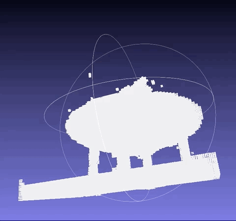

# Notice

Many issues that are not mentioned in detail in the paper affect the performance(In PSNR). 

Including `center_pixel`/`bkg-white bkg`/`dynamic batchsize`/`random bkg`, etc.

Many factors may affect the result, such as `multires(spp)`, `sRGB space`, `errorous sampling`, etc. We do not
try all of them, but will try to increase the performance with them in the future.

Currently, we only try `lego` scene from `NeRF`, which requires a smaller bbox scale. We will try to expand it to real
large scene in the future.

------------------------------------------------------------------------
# Results
For all the experiments, we run for `5w` epoch, and record results every `1w` epoch.

All dataset split follow the original implementation, which is consistent with `vanilla NeRF` implementation.

------------------------------------------------------------------------
## Lego (NeRF Synthetic dataset)
Image size 800x800. Train/Eval: 100/25 (No overlap).

In original [Instant-NGP](https://github.com/NVlabs/instant-ngp) implementation, after `5w` epoch,

- max_samples: 1024, color space: sRGB, max_res: 2048, lr=1e-2
- The original eval uses black background, but original `NeRF` uses white bkg.

| Num steps | time | PSNR in sRGB space | PSNR in linear space| PSNR in white bkg, sRGB | PSNR in white bkg, linear |
|:---------:|:----:|:--------------------:|:-----------------:|:-----------------:|:-----------------:|
| 100 | ~1s | 21.46 | 21.79 | 21.49 | 21.59 |
| 500 | ~5s | 29.62 | 29.83 | 29.34 | 29.02 |
| 2k  | ~15s| 33.42 | 33.67 | 33.06 | 32.73 |
| 1w  |~1min| 35.67 | 35.11 | 35.22 | 34.61 |
| 5w  |~5min| 36.36 | 35.78 | 36.02 | 35.12 |

------------------------------------------------------------------------

Our implementation results:

|          Expname            | precrop | eval_bkg color | rand train bkg | center_pixel | dynamic batchsize | early_stop render| torch_render |  lr  |  loss_weight | PSNR | Epoch 1w | Epoch 2w | Epoch 3w | Epoch 4w | Epoch 5w |
|:---------------------------:|:-------:|:--------------:|:--------------:|:------------:|:-----------------:|:----------------:|:------------:|:---:|:---:|:----:|:--------:|:--------:|:--------:|:--------:|:--------:|
|lego_ngp_final               |0.5-500  | Black | True | True | True  | 1e-4  | False | 1e-1 | 3000 |  |  33.81  |  34.77  |  35.75  |  36.03   | **36.12** | 
|lego_ngp                     | NA | Black | True | True | True  | 1e-4  | False | 1e-2 | 5 |   |  32.65    |  33.61   |  34.68     |  35.10   |     35.22    | 
|lego_ngp_whitebkg            | NA | White | True | True | True  | 1e-4  | False | 1e-2 | 5 |   |  32.28    |  33.35   |  34.48     |  34.90   |     35.02    | 
|lego_ngp_precrop             | 0.5-500  | Black | True | True | True  | 1e-4  | False | 1e-2 | 5 |   |  32.63  |  33.81  |  34.86  |  35.26   |   35.38  | 
|lego_ngp_precrop_5k          | 0.5-5000 | Black | True | True | True  | 1e-4  | False | 1e-2 | 5 |   |  32.60  |  33.72  |  34.75  |  35.13   |     35.26    | 
|lego_ngp_bkgtrainbkg         | NA | Black |  No(Black) | True | True  | 1e-4  | False | 1e-2 | 5 |   |  32.21  |  33.22  |  34.50  |  34.92   |  35.07  | 
|lego_ngp_cornerpixel         | NA | Black | True | False | True   | 1e-4  | False | 1e-2 | 5 |   |  31.21  |  32.07  |  32.91  |  33.23  |  33.31  | 
|lego_ngp_nodynamicbs         | NA | Black | True | True  | False  | 1e-4  | False | 1e-2 | 5 |   |  31.72  |  32.72  |  33.99  |  34.45  |  34.61  | 
|lego_ngp_noearlystoprender   | NA | Black | True | True  | True   |  0.0  | False | 1e-2 | 5 |   |  32.65  |  33.72  |  34.84  |  35.25  |  35.39  |
|lego_ngp_torchrender         | 0.5-500  | Black | True | True | True  | 1e-4  | True | 1e-2 | 5 |   |  32.76  |  33.74  |  34.79  |  35.17  |  35.30   |

* Adding val set in training improves to `37.00`.

Same eval steps as instant-ngp:

| Num steps | our time | PSNR | PSNR(instant-ngp) |
|:---------:|:----:|:----:|:--------------:|
| 100 | ~5s   | 14.12 | 21.46 |
| 500 | ~15s  | 15.77 | 29.62 |
| 2k  | ~40s  | 30.39 | 33.42 |
| 1w  |~3min| 33.81 | 35.67 |
| 5w  |~15min | 36.12 | 36.36 |

* values are small in first 500 epochs since we use cropping image in first 500 epochs.

------------------------------------------------------------------------

# Speed

This repo runs slower than original implementation and other replicates (like [JNeRF](https://github.com/Jittor/JNeRF), [XRNeRF](https://github.com/openxrlab/xrnerf)),
since many operations are re-implemented in torch rather than original CUDA kernel. It will be easier to modify and do experiment in torch.

| Method       |  5w epoch time |
|:------------:|:--------------:|
| instant-ngp  |     ~ 5min     |   
| simplengp    |     ~ 15min    |

* There is lots of overhead in training pipeline which affects the `backward` time. Some time all cost in saving progress results. We will try to improve if we have time.
------------------------------------------------------------------------

# Conclusion

- Lego (White_bkg images)
  - center_pixel: In original `NeRF`, get_rays function uses cornel pixel (0, 1, ...) to get the points in 3d space. It will be more accurate to use
  center pixel(0.5, 1.5, ..) or even spp(multiple samples per pixel) to generate more accurate rendering results. With corner pixel only, the loss in PSNR is considerable.
  - precrop: Apply precrop at the first few iteration helps to get better result(May because of better initiation).
  - eval bkg: For synthetic data like lego, PSNR on black bkg (0,0,0) is better than white bkg(1,1,1). This difference are from the bkg area.
  - Random bkg training: When apply random background on each batch in training, the empty voxel space are easier to be allocated, which improves final result(If initiation is well, not too much).
  - dynamic batch size: Dynamically increase batch size is like getting more sample using same epochs. 
  - sRGB: train in sRGB space and eval in linear space could input the performance as shown in `instant-ngp`, but currently not work on this pipeline. (see `configs/expr/lego_ngp_srgb.yaml`)
  - lr and loss weight: use setting `lr=1e-1 & loss_weight=3000` leads to large sigma result on obj, and performance is much better than `lr=1e-2 & loss_weight=5`
  - render: customized CUDA render function and vanilla NeRF render in torch generates same result, but you need to compact the tensor into the full tensor in `(n_rays, n_pts)`, which takes more space.

- Model checkpoint
  - Since bitfield/density_grid are registered as torch params in the model, they will be saved/loaded automatically.
  But for inference, only bitfield is useful. You can remove the density_grid(tmp) to save storage.
  
------------------------------------------------------------------------

# Full 360 Scene
You can also train instant-ngp in 360 scene, which takes a multi-res volume with `n_cascades` > 1. You have to put all the viewing center near `[0.5, 0.5, 0.5]`.
- how to get the correct pose around center obj needs special attention. You may need to visualize the camera and obj first.

Try `python train --configs configs/mipnerf360/mipnerf360_garden.yaml` / `python train --configs configs/blendedmvs/blendedmvs_scan6.yaml` to see the outdoor/indoor 360 result.
For more scene and how to prepare the dataset, you can visit our project [ArcNerf](https://github.com/TencentARC/ArcNerf).

