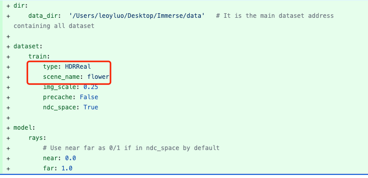

# Guidance for adding new algorithms
We provide an example of adding new algorithm and dataset to this pipeline. This helps you compare new algorithm fairly.

The example is based on [HDR-NeRF](https://github.com/shsf0817/hdr-nerf).

For the commit record, please see https://github.com/TencentARC/ArcNerf/commit/28de457e089e8a4d3a95e6cfb14c95d6338a8a12.

## (1) Dataset
The original repo introduces new dataset, so we need to add [hdrreal_dataset.py](../arcnerf/datasets/hdrreal_dataset.py).

- We found that the dataset is similar to `LLFF` dataset, so we register `HDRReal` as a child class as `LLFF`.

- In this file, the major part is to read images/poses by different mode according to the original paper setting.
For other new dataset, this is still the main issue(If you don't split it manually, you can use `test_holdout` for implementation).

- Other things you may concern is how to read the images/c2w/intrinsic in the file.

-----------------------------------

Since we introduce the key `exp_time`, which is not included in the original repo, we have some other modification:

(1) The inputs in `hdrreal_dataset.py` needs the field `exp_time`, so you need to rewrite the `__getitem__` function.

Since the parent function already returns a dict of input, you only need to add the tensor to it. Remember, the new
tensor should be with size `(hw, d)`, which means that each ray contains a new d-dim vector. The trainer will shuffle the
rays with consistent attributes.

(2) Modify the `POTENTIAL_KEYS` in [init.py](../arcnerf/dataset/__init__.py), this makes the trainer put the new tensor into
gpu for faster loading and correct processing in mode.

(3) Modify the implementation and docs for `prepare_flatten_inputs` and `forward` in [full_model](../arcnerf/models/full_model.py).
Resize it for batch processing.

-----------------------------------

[Test it] Add [flower.yaml](../configs/datasets/HDRReal/flower.yaml) in [HDRReal](../configs/datasets/HDRReal).
Change the config file of [__init__.py](../tests/tests_arcnerf/tests_datasets/__init__.py). Run unittest, the visual result
will be save at `tests/tests_arcnerf/tests_datasets/results`

For this config, you need to change the settings in dataset, to make the visual result correct.

## (2) Model
Since `HDR-NeRF` is close to `NeRF`, where `HDR-NeRF` makes some post-mlp after `NeRF`,
you can make `HDR-NeRF` as a child class of NeRF and add [hdrnerf_model.py](../arcnerf/models/hdrnerf_model.py).

[Notice] Some methods do not work on the model level, but improve by adding new components of encoder/sampling,
you should read the model [doc](./models.md) carefully to see how each part is connected, and modify the modules in
[base_modules](../arcnerf/models/base_modules).

For `HDR-NeRF`, we notice that it only adds some mlps after the radiance network of `NeRF`, so we add those mlps.

See that besides `rgb`, we have a new key `hdr`. Add it to the output for visualization.

[Notice] The `NeRF` is a two stage model with `_coarse/_fine` naming. Remember to implement for both stages.

-----------------------------------

By default radiance net use `sigmoid` for the final rgb, you have to change `out_act_cfg` as `identity` in the model
conf:

Then the mlps can handles dynamic rgb values in `HDR-NeRF`.

-----------------------------------

The model also use new loss using tensor from model, you have to make this tensor available during training

-----------------------------------

Add the model cfg in [conf](../configs/models/hdrnerf.yaml). It can be used for unittest.

## (3) Loss
A new loss function is used, you can add one in [img_loss.py](../arcnerf/loss/img_loss.py) or make other loss files.

All the loss function use the same input `data` and `output`, which are two dict of tensors.

In conf you can add different loss with weights, and they will be combined for calculation.

[Notice] Eval metric is similar to be add in [metric](../arcnerf/metric).

## (4) Visualization
The visualzation of new images for evaluation is in [render_img](../arcnerf/visual/render_img.py).

Since we have one more `HDR` tensor, use tone_mapping and save the uint8 array.

Above only save png image. For real .exr dynamic image, it is not that flexible to be included,
but one way is to change the name as `name.exr`, and change the logic in `write_progress_imgs` to save different kind
of images. Commit is at https://github.com/TencentARC/ArcNerf/commit/f86888c716b25847c8edffe78ccf070d493fa3c2.

## (5) Training
If you don't modify and trainer pipeline for rays preprocessing(in `arcnerf/trainer`), you can add the yaml file
in [conf](../configs/expr/HDRReal).

Change the parts of dataset/model/loss for `HDR-NeRF` is enough.

  

Notice that the `ndc_mode` in arcnerf does not work well, since the view_dir is normed from rays_o in ndc space.
Use `non-ndc space` harms the PSNR by `~0.5`. See commit https://github.com/TencentARC/ArcNerf/commit/efabca2953ced60a9edb2ff5511118d58ad12083.

## (6) Docs
Add the loss of [datasets](datasets.md), [models](models.md), [loss](loss.md).

## (7) Other parts you may need to change

- If you want to change the trainer process (the ray preprocessing), modify [trainer](../arcnerf/trainer).

- For the geometry function, modify or add in [geometry](../arcnerf/geometry).

- For the ray generation function and camera function, modify [rays_helper](../arcnerf/render/ray_helper.py).

- If you need to add new CUDA operation, add it in [ops](../arcnerf/ops)

- For inference function, change [inference](../arcnerf/eval/infer_func.py).
